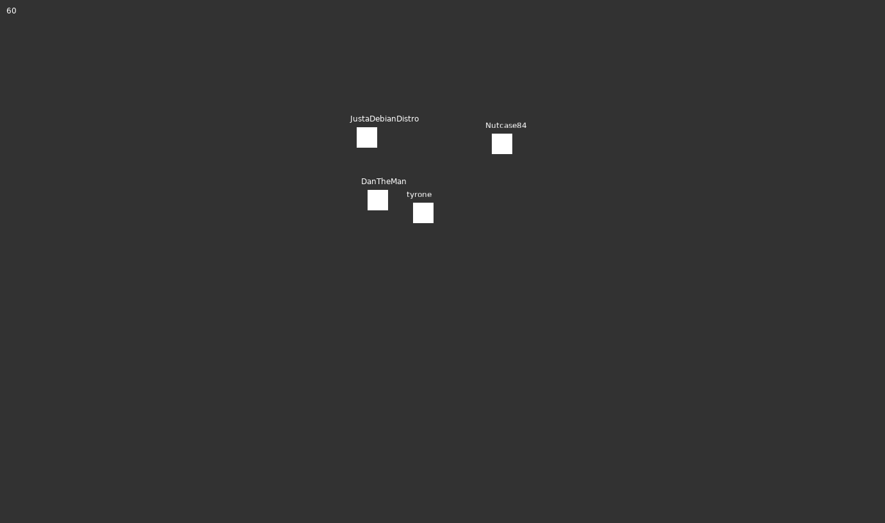

# laughing-engine
## General info about the project 
- **What:** This is basicly just a Terarria clone.
- **Why:** Why not? 
- **Name:** The name was the random github provided name.

# Todo List
*version 0.0.1*

## Multiplayer

- Client and Server map syncing
- Sever IP displayed on the server app
- Changeable player models

## Game functions
- physics

### Map
- Mapgen
- time
- save and load

### Stuff

- breaking blocks
- more blocks
- time function
- npcs
  -bad 
  -good
  -animals

### Player

- Inventory 
- Health
- Hunger

### Items

- Berries
- Sticks

## Graphics
- Game logo
- Changeable player models
- Clouds
- Sun/Moon
